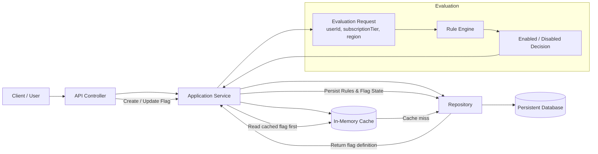
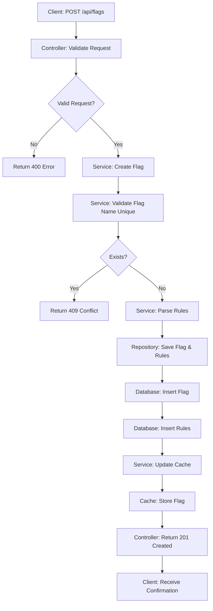
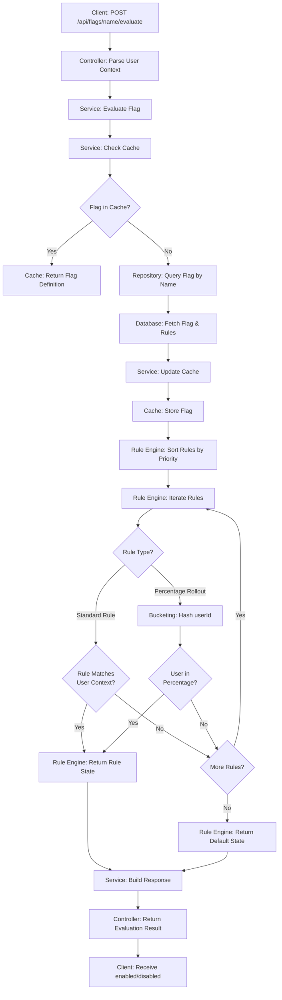
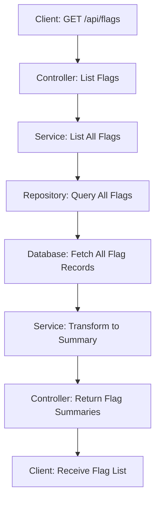
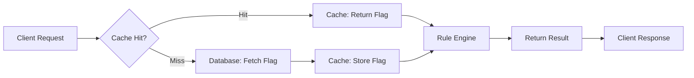

# feature-management

Java Spring Boot project for feature flag management and dynamic feature evaluation.

## Setup Instructions

1. Make sure Java 17+ and Maven are installed.
2. Clone the repository and change into the project folder.
3. Build the project:

   ```bash
   mvn clean package
   ```

4. Run the application:

   ```bash
   mvn spring-boot:run
   ```

5. The service will start on `http://localhost:8080`.

## API

- `POST /api/flags`
  - create a feature flag with `name`, `defaultState`, and `rules`
- `POST /api/flags/{name}/evaluate`
  - evaluate a feature flag based on runtime user context (`userId`, `subscriptionTier`, `region`)
- `GET /api/flags`
  - list all feature flags with their configurations

## Example Requests

### Create a feature flag with context-based rules

```http
POST /api/flags
Content-Type: application/json

{
  "name": "checkout-redesign",
  "defaultState": false,
  "rules": [
    {
      "attribute": "region",
      "operator": "IN",
      "values": ["us", "ca"],
      "state": true,
      "priority": 1
    },
    {
      "attribute": "subscriptionTier",
      "operator": "IN",
      "values": ["pro"],
      "state": true,
      "priority": 2
    }
  ]
}
```

### Create a feature flag with percentage rollout

```http
POST /api/flags
Content-Type: application/json

{
  "name": "new-ui-feature",
  "defaultState": false,
  "rules": [
    {
      "attribute": "userId",
      "operator": "PERCENTAGE_ROLLOUT",
      "values": [],
      "state": true,
      "priority": 0,
      "percentageRollout": 30
    }
  ]
}
```

This rolls out the feature to approximately 30% of users deterministically based on userId hash. The same userId will always receive the same rollout decision.

### Evaluate a feature flag

```http
POST /api/flags/checkout-redesign/evaluate
Content-Type: application/json

{
  "userId": "user-123",
  "subscriptionTier": "pro",
  "region": "us"
}
```

### Example response

```json
{
  "featureFlagName": "checkout-redesign",
  "enabled": true,
  "result": "ON"
}
```

## Test

    mvn test

## Architecture Overview



## High-Level Flow

1. A client sends a request to create or update a feature flag.
2. The controller passes the request to the service layer.
3. The service stores the flag definition and rules in the database.
4. The service also updates the in-memory cache for fast future reads.
5. When a feature is evaluated, the client sends user context such as userId, subscriptionTier, and region.
6. The service checks the cache first; if the flag is missing, it loads it from the database.
7. The rule engine evaluates the flag against the provided context.
8. The service returns the final enabled or disabled result.

---

## Detailed Flow Diagrams

### 1. Create Flag Flow



### 2. Evaluate Flag Flow



### 3. List Flags Flow



### 4. Cache Interaction Flow


